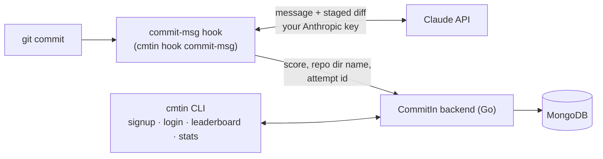

# CommitIn


**A git hook that judges your commit messages so your teammates don't have to.**

CommitIn (`cmtin`) sits on `git commit`. It sends your message and your staged diff to Claude, and if the message is lazy it **rejects the commit**, roasts you, and hands you a better message written from the actual diff. If the message is good, the commit goes through and you get a compliment.

> **Status: in development.** A hosted CommitIn service (one shared backend, so one global leaderboard) will launch when it's ready. Until then you run the backend yourself; see [Getting started](#getting-started).

Everything happens in the terminal. There is no dashboard, and there is no paid tier: the leaderboard and your personal stats are free, and you bring your own Anthropic API key, so judging costs the project nothing.

```text
$ git commit -m "fix stuff"
✗ 2/10 -- groundbreaking work. truly the pinnacle of documentation.

Try this instead:
  fix: correct off-by-one in pagination of list_users

$ git commit -m "fix: correct off-by-one in pagination of list_users"
✓ 9/10 -- specific, imperative, and it actually matches the diff.
[main 4f2c1ab] fix: correct off-by-one in pagination of list_users
```

*(Illustrative output; the roasts are generated fresh each time.)*

## Features

- **A real gate.** A message scoring below 6/10 blocks the commit. You retry with a better one, or use the suggestion.
- **Fails open.** If the network is down, your key is missing or rate-limited, or the API errors, the commit goes through anyway. CommitIn never becomes the reason you can't commit.
- **Roasts and suggestions are based on the diff**, not just the text of the message.
- **Public leaderboard**: ranked by *average* score over a rolling 30 days (minimum 10 judged commits), so volume can't buy rank.
- **Personal stats** (`cmtin stats`): average, trend against the previous 30 days, rejection rate, a daily sparkline and weekly breakdown.
- **Skips what isn't worth judging**: merge commits, empty commits, and quiet mode (`cmtin quiet`).

## How it works



`cmtin init` writes a tiny shell script to `.git/hooks/commit-msg`. Git runs it on every commit and passes it the message file; the script calls `cmtin hook commit-msg`, whose exit code decides whether the commit proceeds.

## Getting started

### Requirements

- Go 1.26+ and git
- An [Anthropic API key](https://console.anthropic.com/) (judging uses Claude Haiku 4.5, billed to your key; a judged commit is a tiny request)
- A CommitIn backend to talk to (see below)
- A real terminal: `signup`, `login`, `logout` and `init` use interactive forms

### 1. Run a backend (until the hosted service launches)

The hosted service isn't live yet, so for now you run the backend yourself. It's one small Go binary plus any MongoDB (the free Atlas tier is plenty, or a local `mongod`). Everyone who points their CLI at a backend shares that backend's leaderboard. Once the hosted service launches, you'll skip this step entirely.

```bash
cd backend
cp .env.example .env        # then set MONGODB_URI (and optionally MONGO_DB, PORT)
go run ./cmd/server         # listens on :8080
```

### 2. Build the CLI

```bash
cd cli
go build -o ../bin/cmtin ./cmd/cmtin
```

The installed git hook looks for `cmtin` **on your `PATH`** at commit time, so put the binary somewhere on it:

```bash
install -m 755 ../bin/cmtin ~/.local/bin/cmtin
```

(If it can't be found, the hook prints a warning and lets the commit through.)

### 3. Set up

```bash
cmtin signup            # create an account on your backend
cmtin init              # in any git repo: installs the hook, asks for your Anthropic key
git commit -m "wip"     # meet your new reviewer
```

The CLI talks to `http://localhost:8080` by default (that default will point at the hosted service once it launches). Point it elsewhere with `--api-url` or `COMMITIN_API_URL`.

## Commands

| Command | What it does |
| --- | --- |
| `cmtin signup` / `login` / `logout` | Manage your account |
| `cmtin init` | Install the commit-msg hook in the current repo (needs a login) |
| `cmtin uninstall` | Remove CommitIn's hook (never touches a hook it didn't write) |
| `cmtin quiet [on\|off]` | Pause or resume judging without uninstalling |
| `cmtin leaderboard` | The public leaderboard, with your row highlighted |
| `cmtin stats` | Your own history and trend |

## Configuration

| Setting | Where |
| --- | --- |
| Anthropic key | prompted by `cmtin init`, saved in the config file; `ANTHROPIC_API_KEY` overrides it |
| Backend URL | `--api-url`, `COMMITIN_API_URL`, or the URL saved at login |
| Config file | `$XDG_CONFIG_HOME/cmtin/config.json` (default `~/.config/cmtin/config.json`, mode 0600) |
| Backend | `MONGODB_URI` (required), `MONGO_DB` (default `commitin`), `PORT` (default `8080`) |

## What leaves your machine

CommitIn reads your diffs, so it's worth being explicit:

- **To Anthropic (with your key):** the commit message and the staged diff, truncated to 400 lines. This is what gets judged.
- **To the CommitIn backend:** only the numeric score, a random per-attempt id, the *directory name* of the repo, and a timestamp. **Never your commit message or your diff.**
- The leaderboard shows usernames, average scores and commit counts, and nothing else. Emails are never exposed.
- Passwords are stored as bcrypt hashes and session tokens as hashes.
- Logging out stops score submission, and judging keeps working locally with your key.

## Repository layout

```
backend/   Go HTTP API: accounts, sessions, scores, leaderboard, stats (MongoDB)
cli/       the cmtin binary: hook logic, Claude client, terminal UI
```

The two are separate Go modules tied together by a `go.work` workspace.

## Contributing

Issues and pull requests are welcome, especially roast examples, edge cases in git behavior, and terminal quirks. See [CONTRIBUTING.md](CONTRIBUTING.md) for how to build and test, including how to develop without spending any API credits.

## License

[MIT](LICENSE)
